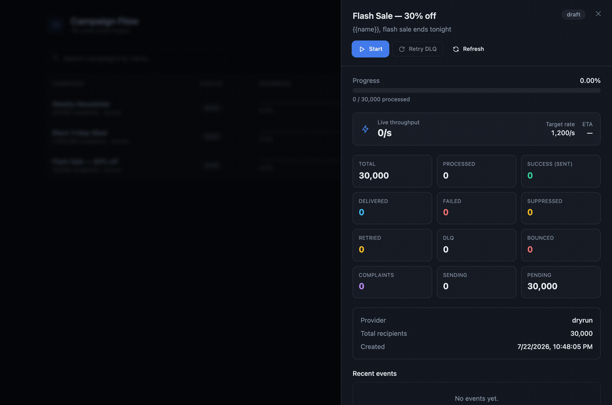
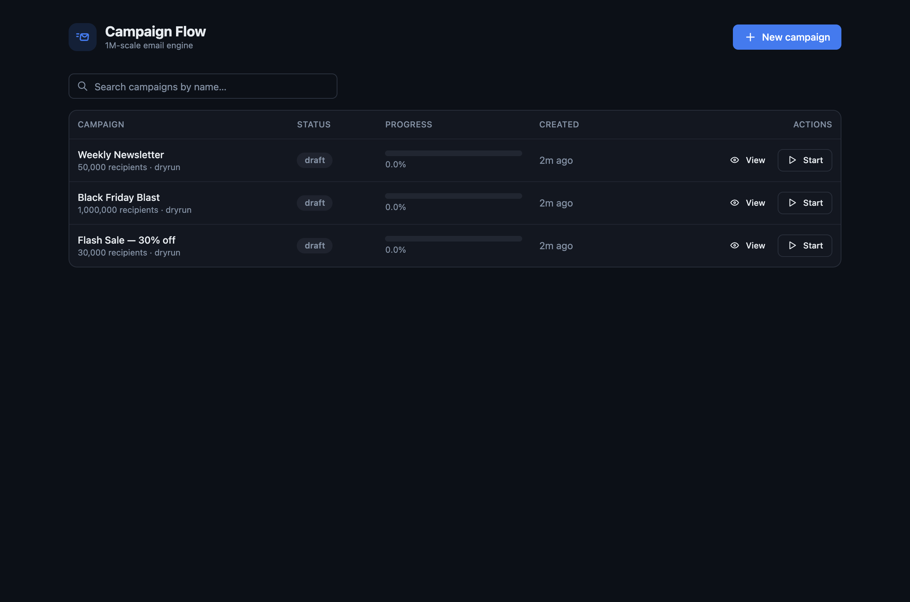
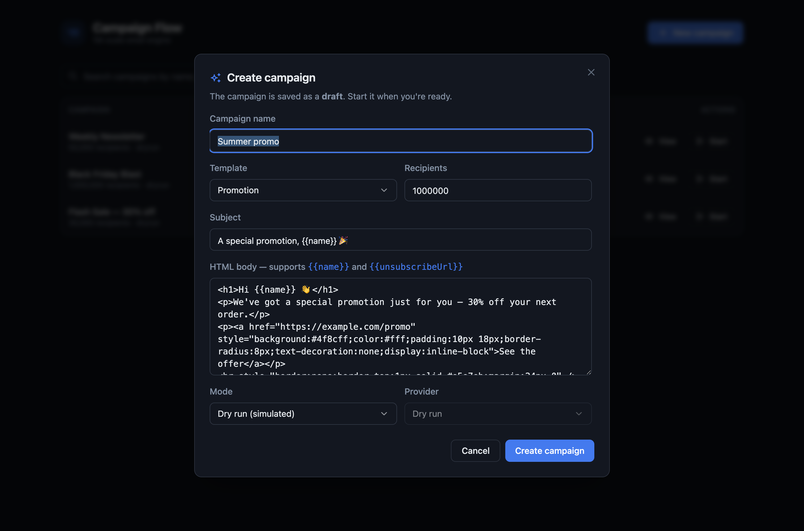
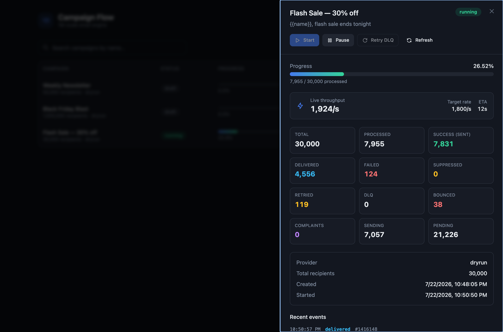
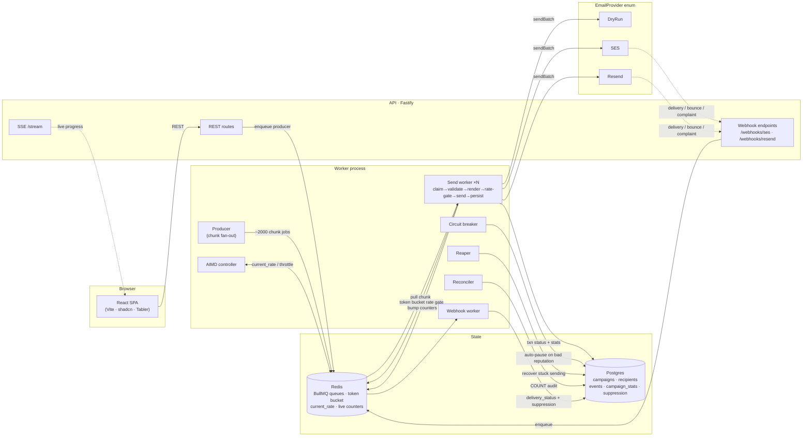
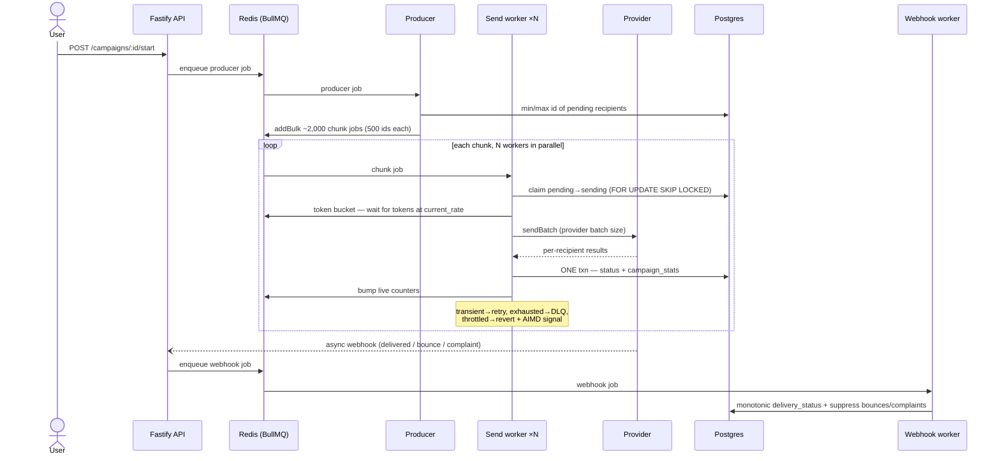
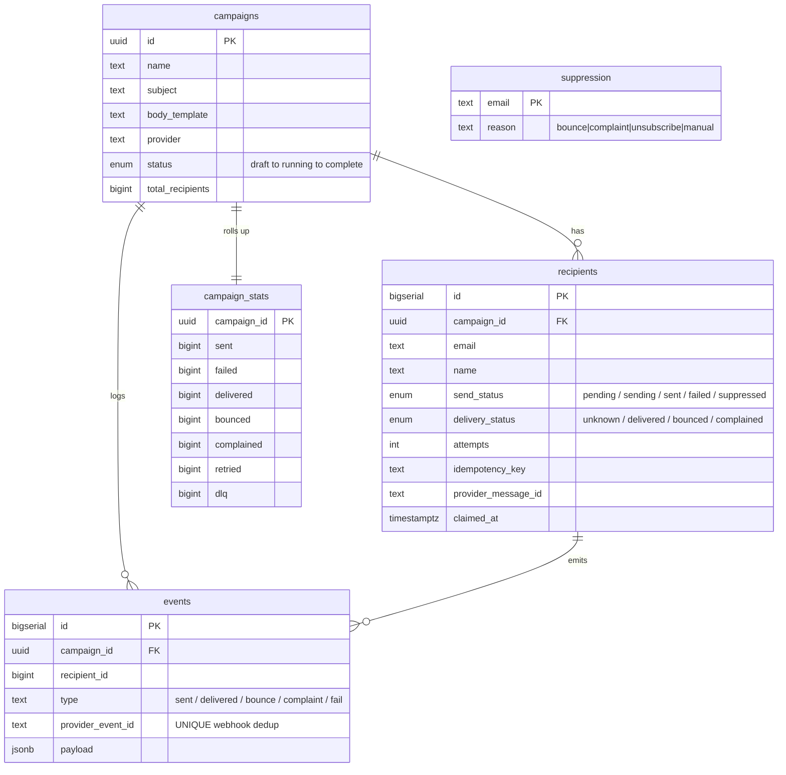

# Campaign Flow

**A high-throughput email campaign engine that sends one promotional email to 1,000,000 recipients — personalized per recipient — as fast as the provider allows, with real tracking, adaptive rate control, retries/DLQ, a reputation circuit-breaker, and a live dashboard.**



- **`campaign-flow-backend`** — TypeScript · Fastify API + BullMQ workers · Postgres · Redis
- **`campaign-flow-web`** — Vite + React · Tailwind + shadcn-style UI + Tabler icons

---

## Table of contents

1. [What this is & the objective](#1-what-this-is--the-objective)
2. [The core insight](#2-the-core-insight-the-provider-is-the-bottleneck)
3. [Screenshots](#3-screenshots)
4. [High-level design (HLD)](#4-high-level-design-hld)
5. [The send flow, step by step](#5-the-send-flow-step-by-step)
6. [Data model](#6-data-model)
7. [Why this stack — decisions, alternatives & reflection](#7-why-this-stack--decisions-alternatives--reflection)
8. [Bottlenecks](#8-bottlenecks)
9. [API reference](#9-api-reference)
10. [Running it](#10-running-it)
11. [Cost](#11-cost)
12. [Production roadmap / known limitations](#12-production-roadmap--known-limitations)
13. [Assumptions](#13-assumptions)

---

## 1. What this is & the objective

The task: **send the same promotional email, personalized with each person's name, to 1,000,000 addresses, and make it finish as fast as reasonably possible.**

The objective is not "write a `for` loop that calls a send API." At a million recipients, a naive loop is both too slow (sequential HTTP) and dangerous (it ignores rate limits, retries, deliverability, and reputation — any of which can get your sending account suspended mid-campaign). The real objective is a **system** that:

- **saturates** whatever send rate the provider grants — and *discovers* that rate adaptively,
- **degrades gracefully** under throttling instead of hammering into 429s,
- **never double-sends** across retries and crashes,
- **protects the sending reputation** (auto-pauses on a bad list),
- **reports honest, real-time progress** and full history,
- and does all of the above **without emailing real people** (a configurable dry-run that simulates every failure mode).

---

## 2. The core insight: the provider is the bottleneck

> **Your code is not the bottleneck. The email provider's rate limit and deliverability are.**

Wall-clock time for 1M is `1,000,000 / granted_rate`. Everything else is secondary:

| Send rate | Time for 1M | Notes |
|---|---|---|
| 1/sec | ~11.6 days ❌ | SES sandbox — unusable |
| 14/sec | ~20 hours | SES post-sandbox default |
| 500/sec | ~33 min | modest quota raise |
| **1,667/sec** | **~10 min** | realistic warmed account |
| 2,000/sec | ~8.3 min | |

So the engine is built to **ride the ceiling**, whatever it is. On the **dry-run** provider the only real work is database writes, so 1M finishes in ~10 minutes on a laptop — proving the pipeline can push far past any real quota, leaving the provider as the only variable.

---

## 3. Screenshots

**Campaign list** — searchable (client-side filter), status badges, live progress, per-row actions:



**Create campaign** — predefined templates, `{{name}}` personalization, dry-run vs live provider; saved as a draft:



**Live detail sheet** — progress, live throughput, target rate (AIMD), ETA, and every metric: sent, delivered, failed, retried, **DLQ**, bounced, complaints, plus a live event feed and Start/Pause/Resume/**Retry-DLQ**:



---

## 4. High-level design (HLD)

Two processes (API and worker) over Postgres + Redis. Only the **send worker** scales horizontally; the control loops are single-instance.



**Why this shape:**
- **API and worker are separate processes** — a 1M send must never make the dashboard unresponsive. The API only enqueues and reads; the worker does all the heavy lifting.
- **Redis is the coordination plane** — queue, the global rate limiter, `current_rate`, and live counters all live here so N workers act as one.
- **Postgres is the source of truth** — durable per-recipient state and the authoritative counts the reconciler audits against.

---

## 5. The send flow, step by step



**The mechanics that make it fast *and* correct:**

- **Chunk jobs, not 1M jobs.** The producer fans a campaign into ~2,000 id-range jobs (500 each). Enqueuing a million individual jobs would itself be the bottleneck; id-ranges also mean the producer never loads rows into memory.
- **Global token bucket (Redis Lua).** Every worker asks the *same* bucket for tokens before each batch, keyed **per provider account** (rate is an account-level resource shared by all campaigns). N workers therefore respect one rate instead of each racing to "as fast as possible."
- **AIMD adaptive rate.** Additive-increase while clean, multiplicative-decrease on a throttle — discovers the true usable rate without knowing the exact quota.
- **Idempotent claiming.** `UPDATE … WHERE status='pending' … FOR UPDATE SKIP LOCKED RETURNING` — concurrent workers claim disjoint rows; reprocessing can't double-count because `campaign_stats` is incremented only by the rows a conditional update actually changed.
- **Retry / DLQ.** Per-recipient `attempts`; transient errors retry with backoff, permanent (invalid/hard-bounce) fail immediately, exhausted → DLQ (`failed` + `retries_exhausted`), one-click requeue via `/retry`.
- **Async feedback loop.** Delivery/bounce/complaint arrive later via webhook; ingest is idempotent (dedup by `provider_event_id`) and monotonic (never downgrades a bounce), and bounces/complaints feed the suppression list + circuit-breaker.

---

## 6. Data model



Two **orthogonal status axes** (`send_status` and `delivery_status`) instead of one column, because a recipient can be `sent` and then `bounced` — separate timelines that must not overwrite each other.

---

## 7. Why this stack — decisions, alternatives & reflection

| Decision | What we chose | Alternatives considered | Why / reflection |
|---|---|---|---|
| **Language** | TypeScript (Node) | Go, Rust | The bottleneck is the provider, not CPU — so raw throughput buys little. TS wins on clarity, ecosystem (BullMQ, SDKs) and being reviewable. *Reflection:* if we ever needed to saturate a truly enormous quota on one box, Go's concurrency + lower overhead would matter; here it wouldn't move the needle. |
| **Queue** | BullMQ (Redis) | Postgres-based queue (pg-boss / SKIP LOCKED), Kafka, SQS | BullMQ gives retries, backoff, delayed jobs, rate-limiting primitives and a DLQ out of the box on infra we already run. *Reflection:* Kafka/SQS scale further but are heavy for a single-VPS demo; a pure-Postgres queue would drop a moving part but reimplements what BullMQ already does well. |
| **Rate limiter** | Custom Redis token bucket (Lua) | BullMQ's built-in queue limiter, per-worker limiter | We need one **global, account-level** rate shared across workers *and* dynamically adjustable by AIMD. BullMQ's limiter is per-queue and coarse; per-worker limiters stampede. *Reflection:* the Lua bucket is ~30 lines and gives exactly the control the AIMD loop needs. |
| **Rate control** | AIMD (additive-increase / multiplicative-decrease) | Fixed configured rate, PID controller | AIMD discovers the ceiling without knowing the quota and is battle-tested (it's how TCP congestion control works). *Reflection:* a fixed rate wastes headroom or invites throttling; a PID controller is overkill for a one-dimensional signal. |
| **DB** | Postgres | MySQL, a document store | Needs transactional multi-row updates, `FOR UPDATE SKIP LOCKED`, partial indexes, `generate_series` seeding, `FILTER` aggregates — all Postgres strengths. |
| **ORM** | Drizzle + raw SQL for hot paths | Prisma, TypeORM | Drizzle is thin and lets hot paths (claim, bulk status update, seeding) be hand-written SQL. *Reflection:* Prisma's DX is nice but its generated queries and lack of easy `SKIP LOCKED` would fight the hot path. |
| **API** | Fastify | Express, NestJS, Next API routes | Fast, first-class async, easy SSE via `reply.raw`. The backend is its own service with long-running workers, so folding it into Next routes made no sense. |
| **Frontend** | Vite + React + Tailwind + shadcn-style + Tabler | Next.js, plain HTML | The web is a pure client of the API — Vite is leaner and faster to build than Next. shadcn-style components give a polished dialog/sheet/table kit without a heavy UI framework. |
| **Live progress** | Server-Sent Events (SSE) | WebSockets, polling | Progress is one-directional server→client; SSE is simpler, proxy-friendly, and auto-reconnects. WebSockets would be over-engineered. |
| **Dry-run provider** | First-class provider behind the enum | Mocking the SDK in tests only | Making dry-run a real provider means the *entire* pipeline (retries, DLQ, AIMD, breaker, webhooks) runs identically to production — the demo exercises real code, not a stub. |
| **Deployment** | Single-root `docker-compose`, one VPS | k8s, managed queue/db | The provider caps throughput, so we don't need a cluster. Compose on a ~€7/mo Hetzner box runs everything; `--scale worker=N` is the scaling knob. |

---

## 8. Bottlenecks

Ranked by impact on the actual goal:

1. **Provider quota / rate limit** — *the* ceiling. SES sandbox is 1/sec; production starts ~14/sec, and both the per-second rate and the 24-hour quota must be raised (gradually, reputation-based) to hit 1M/run. **Mitigation:** AIMD saturates whatever is granted; the pipeline itself is proven far faster on dry-run.
2. **Deliverability & reputation** — bounce >10% can suspend the account; complaint >0.3% collapses inbox placement. **Mitigation:** circuit-breaker auto-pause, suppression list, email validation, one-click unsubscribe.
3. **Enqueue throughput** — solved by chunk jobs (~2,000, not 1M) and `addBulk`.
4. **Counter write contention** — solved by per-chunk transactional increments (not per-email) + Redis live counters + a reconciler audit.
5. **DB connection exhaustion under scaled workers** — shared pool sized above worker concurrency.
6. **Webhook volume** — async ingest queue, idempotent + monotonic, batched.
7. **Redis as SPOF** — AOF persistence so queue + rate state survive a restart.

---

## 9. API reference

Base URL: `http://localhost:4000`

| Method | Path | Body | Description |
|---|---|---|---|
| `GET` | `/health` | — | Liveness + active provider |
| `POST` | `/campaigns` | `{ name, subject, bodyTemplate, provider?, fromEmail? }` | Create a campaign (draft) |
| `GET` | `/campaigns` | — | List campaigns with live counters |
| `GET` | `/campaigns/:id` | — | Campaign view: counters, target rate, progress |
| `POST` | `/campaigns/:id/recipients` | `{ count }` | Generate N synthetic recipients (async) |
| `POST` | `/campaigns/:id/start` | — | Fan out and begin sending |
| `POST` | `/campaigns/:id/pause` | — | Pause (drains in-flight, then halts) |
| `POST` | `/campaigns/:id/resume` | — | Resume a paused campaign |
| `POST` | `/campaigns/:id/cancel` | — | Cancel (leaves pending auditable) |
| `POST` | `/campaigns/:id/retry` | — | Requeue dead-lettered recipients |
| `GET` | `/campaigns/:id/events` | — | Recent events (delivered/bounce/complaint/fail) |
| `GET` | `/campaigns/:id/stream` | — | **SSE** live progress (counters + rate) |
| `POST` | `/webhooks/ses` | SNS notification | SES delivery/bounce/complaint ingest |
| `POST` | `/webhooks/resend` | Resend event | Resend delivery/bounce/complaint ingest |
| `GET`/`POST` | `/unsubscribe?t=<token>` | — | One-click unsubscribe → suppression |

---

## 10. Running it

**Prereqs:** Node 20+, Docker.

### Local dev

```bash
# 1. Infra (Postgres :5433, Redis :6379)
docker compose up -d postgres redis

# 2. Backend
cd campaign-flow-backend
cp .env.example .env
npm install
npm run db:migrate
npm run start          # API on :4000  (terminal 1)
npm run worker         # worker        (terminal 2)

# 3. Web
cd ../campaign-flow-web
npm install
cp .env.example .env
npm run dev            # http://localhost:5173
```

Open the web app → **New campaign** → generate 1,000,000 recipients → **Start**, and watch the AIMD ramp, live throughput, and delivery/bounce/complaint counters.

### CLI (no UI)

```bash
cd campaign-flow-backend
npm run seed -- 1000000                     # seeds a campaign, prints its id
curl -X POST localhost:4000/campaigns/<id>/start
curl -s localhost:4000/campaigns/<id> | jq .counters
```

### Docker (single root compose)

```bash
docker compose --profile app up --build            # postgres, redis, api, worker, web
docker compose --profile app up --scale worker=3   # scale send throughput
```

### Demo every failure path (dry-run knobs)

```bash
DRYRUN_BOUNCE_RATE=0.08 npm run worker    # 8% bounces > 5% → circuit-breaker auto-pauses
DRYRUN_THROTTLE_RATE=0.2 npm run worker   # watch AIMD target rate drop, then recover
```

---

## 11. Cost

The provider is ~100% of the real cost; infra is a rounding error.

| Item | Cost |
|---|---|
| **SES send** | ~$0.10 / 1,000 → **~$100 per 1M** (cheapest at scale) |
| **Resend** | dev-friendly, pricier per email; 1M needs a scale/enterprise plan |
| **Hetzner VPS** (CX32, 4 vCPU / 8GB) | **~€7/mo** — runs everything |
| Bandwidth | negligible (API calls are ~KB) |

---

## 12. Production roadmap / known limitations

Stated honestly — these are the gaps between "excellent take-home" and "production," including issues surfaced by a self-review:

**Correctness / robustness**
- **Single-instance control loops.** AIMD/breaker/reaper/reconciler currently start in every worker; with `--scale worker=N` the AIMD throttle signal is consumed non-idempotently. Production needs **leader election** (or a dedicated controller process) so exactly one instance runs the loops.
- **Subject personalization** is HTML-escaped like the body; the Subject header is not HTML and should use a non-escaping render path.
- **Start-before-seed guard.** Starting a campaign while async recipient generation is still running can leave late-inserted rows uncovered; generation should complete (or be transactional/flagged) before start is allowed.
- **`settled` transition.** Nothing moves `send_complete → settled`, so the reconciler keeps auditing finished campaigns. Add a settle step once delivery feedback drains, and stop reconciling settled campaigns.
- **SSE should call `reply.hijack()`** so Fastify doesn't attempt to manage the hijacked response.
- **Exactly-once.** Delivery is **at-least-once** (a crash after send but before commit can re-send). Stronger guarantees need provider-side idempotency keys + a dedupe window.

**Deliverability & compliance (need real accounts / time)**
- SES sandbox exit + quota-increase process; **IP/domain warmup**; dedicated-IP setup.
- **Webhook signature verification** (SNS / Resend) — mapping is implemented, signature checks are stubbed.
- Full CAN-SPAM / GDPR posture (consent records, physical address, DMARC/BIMI).

**Scale & ops**
- **Partition `events` by campaign** for cheap retention (`DROP PARTITION`).
- Batch the `listCampaigns` counter reads (currently one Redis call per campaign).
- HA: multi-node workers, Redis/Postgres replication, metrics/alerting (Prometheus + the circuit-breaker alert).

---

## 13. Assumptions

- **No real emails are sent** — the demo uses the dry-run provider; recipients are synthetic (`user{n}@example.com`), with a configurable slice deliberately invalid to exercise validation.
- The 1M list is assumed **consented** (the sender's legal responsibility); the system provides the *mechanisms* (unsubscribe token + one-click header, suppression) to stay compliant.
- Single-VPS target; the design scales horizontally (more worker processes) but the demo runs on one box.
- The dry-run finish time (~10 min for 1M) is a deliberate, configurable pace so the live UI is watchable; the pipeline itself can go much faster.

---

*See [`docs/DESIGN.md`](docs/DESIGN.md) for the deeper design write-up (data lifecycle, correctness argument, control-loop state machines, and full failure-mode analysis).*
